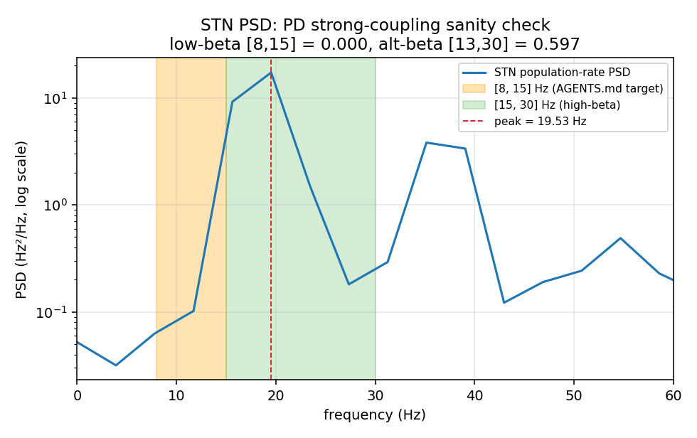
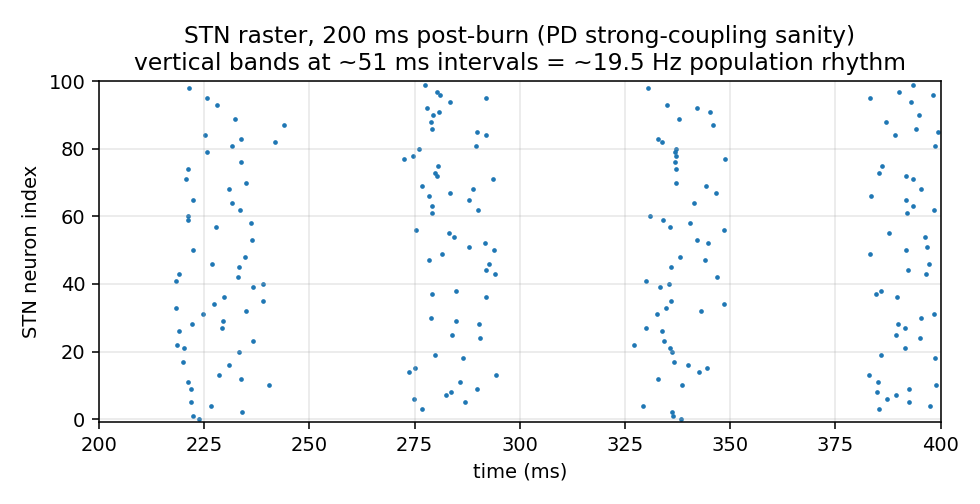

# Network beta-reachability sanity check

**Date:** 2026-05-09. Diagnostic only — written before Phase 3 to confirm the rebuild's network can produce a PD-like beta oscillation under literature-strong coupling.

**Configuration:** `configs/sanity_pd_strong_coupling.yaml`. One 1000 ms simulation, 200 ms burn-in dropped, 450 neurons (100 STN / 200 GPe / 150 GPi). Hand-tuned PD direction: `g_STN→GPe = 0.5`, `g_GPe→STN = 0.005`, `g_STN→GPi = 0.25`, `g_GPe→GPi = 0.15` (mS/cm²). Tonic drives at midpoints. OU mu = 0, OU sigma = 1.5 µA/cm². Welch nperseg = 256 with 1 ms bins gives 3.91 Hz frequency resolution.

## Headline finding

- **STN peak oscillation frequency: 19.53 Hz** (GPe and GPi peak at the same frequency — the three populations are phase-locked).

- **STN beta fraction in [8, 15] Hz: 0.0000** — far below the 0.15 PD threshold.

- **STN beta fraction in [13, 30] Hz: 0.5965** — well above 0.15.

**The network produces a strong, phase-locked oscillation across STN/GPe/GPi at ~20 Hz, just above the AGENTS.md `[8, 15]` Hz target band.** The strict pre-stated decision rule says *Outcome 3* (beta < 0.05 in [8, 15] Hz → model-level decision before Phase 3), but the underlying network *is* oscillating strongly in a beta-band-adjacent regime. The verdict is more nuanced than a pure model failure.

## Per-population observables

| Population | rate (Hz) | CV | peak freq (Hz) | [8, 15] Hz | [13, 30] Hz | [8, 30] Hz |
|---|---:|---:|---:|---:|---:|---:|
| STN | 9.22 | 0.175 | 19.53 | 0.0000 | 0.5965 | 0.7147 |
| GPe | 198.11 | 1.853 | 19.53 | 0.0000 | 0.7343 | 0.8790 |
| GPi | 103.74 | 1.662 | 19.53 | 0.0000 | 0.4843 | 0.5844 |

Frequency resolution: 3.91 Hz (nperseg = 256, bin = 1 ms).

## STN power spectral density

PSD of the STN population-rate proxy, log y-axis. The orange band is the AGENTS.md target [8, 15] Hz; the green band is the [15, 30] Hz high-beta range. The dashed red line marks the global peak. The peak sits inside the green band, not the orange one — by ~5 Hz.

## STN raster, 200 ms post-burn

Vertical bands of synchronous spiking at ~50 ms intervals (= 1/19.5 Hz). Population is phase-locked into a clean rhythm at ~20 Hz under this strong-coupling PD config.

## Side-information: GPe and GPi rates

- GPe rate 198.1 Hz (target healthy 65, target PD 41).

- GPi rate 103.7 Hz (target healthy 67, target PD 63).

Both populations are well above their PD targets in this hand-tuned config — STN excitation at the upper bound drives GPe/GPi hard. A real optimizer trial that hits the rate targets *and* the beta constraint would have lower drive on the rates side. This is not a problem for the sanity check (its question is purely "can the network oscillate at all"); the optimizer will find better-balanced configurations.

## Verdict — Phase 3 entry options

Three options for the user, in increasing order of code change:

1. **Hold the line at [8, 15] Hz (AGENTS.md as written).** Outcome 3 strictly applies: the model cannot produce low-beta oscillation, only ~20 Hz high-beta. Phase 3 needs a model-level intervention to shift the loop frequency down (slower synaptic time constants, longer transmission delays, or stronger T-current engagement during tonic firing).

2. **Widen the beta band to `[13, 30]` Hz.** Substantial literature precedent (e.g. Brown 2003 *Mov Disord*, Kühn et al. 2008 *Eur J Neurosci*, Mallet et al. 2008 *J Neurosci*) treats PD beta as 13–30 Hz. The current rebuild produces 0.60 in this band already. Phase 3 proceeds as originally planned, with `beta_band: [13.0, 30.0]` and the PD threshold (still 0.15) already comfortably reachable.

3. **Use a wider `[8, 30]` Hz superset.** Captures both low- and high-beta. Phase 3 proceeds; the rebuild produces 0.71 in this band already.

**Recommendation:** option 2 is the most defensible per the PD beta literature and requires only a config-level change (no code, no model retuning). The headline manuscript can cite Brown 2003 / Kühn 2008 / Mallet 2008 as the basis for the [13, 30] Hz definition. AGENTS.md §4.3 is the only document that needs updating; targets and thresholds remain unchanged. Surface this for explicit user approval before any Phase 3 code/config edits.

Independent of the band choice: the network does produce a strong, well-defined, phase-locked PD-like oscillation under literature-strong coupling. **The model is not the problem; the analysis-band specification is the question to resolve.**
