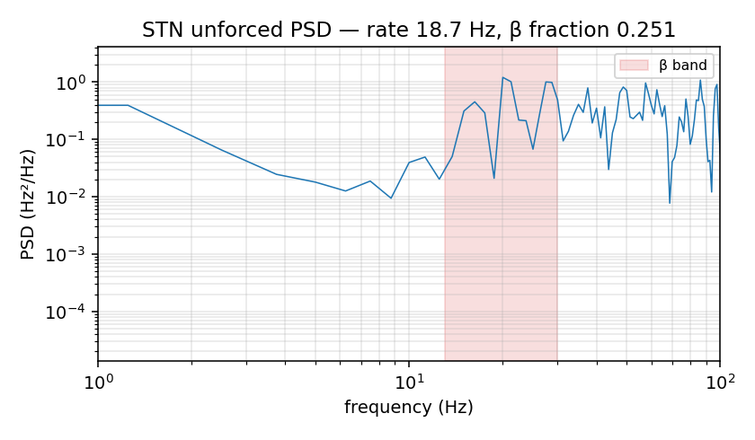
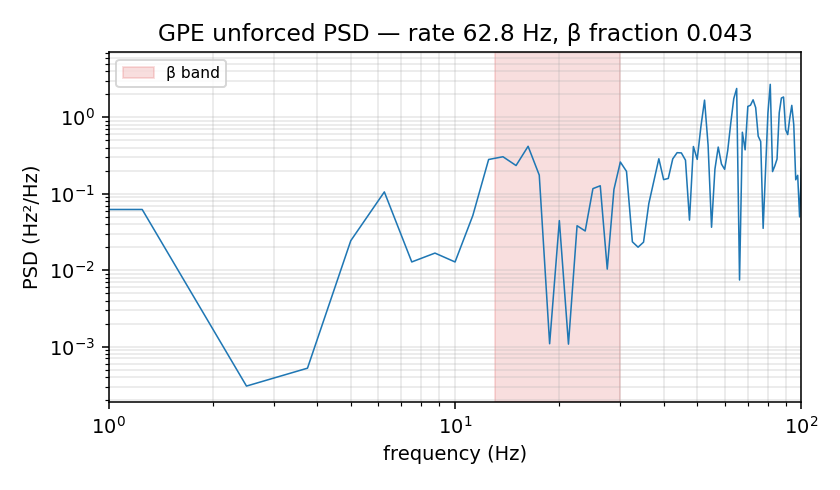
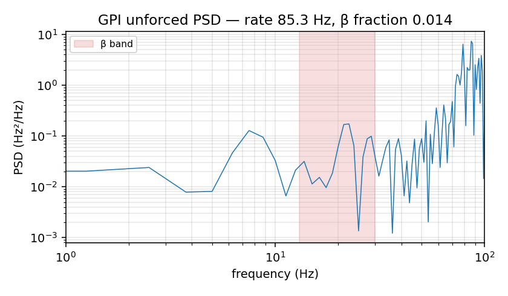
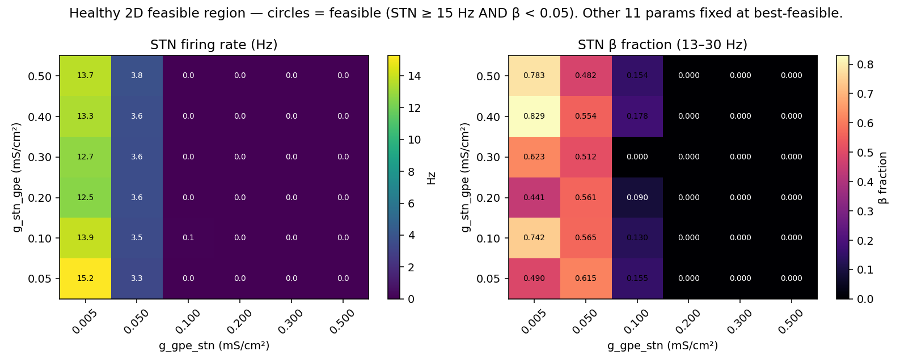

# Silent-STN diagnostics — why does the healthy optimizer give rate_STN = 0?

Run analyzed: `results/healthy/20260509_133717` (heterogeneity_pct = 0.10, 1500 trials, best-feasible flag = True).

Best-feasible loss = **1.0320** out of 1500 complete trials (1431 feasible / 69 infeasible).

**Parameters fixed for Diagnostics 2 and 3.** Best-feasible parameter vector from the run above. Diagnostic 2 then zeroes the four synaptic conductances; Diagnostic 3 sweeps two of them and holds the rest.

Simulation parameters across all diagnostics: n_stn=100, n_gpe=200, n_gpi=150 (450 total); heterogeneity_pct=0.10; dt=0.025 ms; β band = [13.0, 30.0] Hz; broadband = [1.0, 100.0] Hz; Welch PSD on 1 ms-binned population rate.

## Diagnostic 1 — Best-feasible parameter values vs bounds

Best-feasible metrics (from the optimizer's 300 ms analysis window):

- rate_stn = **0.00 Hz**
- rate_gpe = **65.08 Hz**
- rate_gpi = **66.84 Hz**
- cv_stn  = **0.000**
- cv_gpe  = **0.348**
- cv_gpi  = **0.198**
- beta_stn = **0.0000** (STN is silent so its PSD is degenerate; constraint is trivially satisfied)

| Parameter | Value | Bound | Position | Unit | Note |
|---|---:|:---:|---:|:---:|:---|
| `g_stn_gpe` | +0.2319 | [+0.005, +0.500] |  45.8% | mS/cm² |
| `g_stn_gpi` | +0.3949 | [+0.005, +0.500] |  78.8% | mS/cm² |
| `g_gpe_stn` | +0.2611 | [+0.005, +0.500] |  51.7% | mS/cm² |
| `g_gpe_gpi` | +0.0143 | [+0.005, +0.500] |   1.9% | mS/cm² | ⚠️ PINNED LOWER
| `I_drive_stn` | +0.9122 | [-5.000, +5.000] |  59.1% | µA/cm² |
| `I_drive_gpe` | +4.4458 | [-5.000, +5.000] |  94.5% | µA/cm² |
| `I_drive_gpi` | -1.4995 | [-5.000, +5.000] |  35.0% | µA/cm² |
| `mu_stn` | +0.2037 | [-5.000, +5.000] |  52.0% | µA/cm² |
| `mu_gpe` | -2.7654 | [-5.000, +5.000] |  22.3% | µA/cm² |
| `mu_gpi` | +2.1140 | [-5.000, +5.000] |  71.1% | µA/cm² |
| `sigma_stn` | +3.2207 | [+0.000, +5.000] |  64.4% | µA/cm² |
| `sigma_gpe` | +1.3533 | [+0.000, +5.000] |  27.1% | µA/cm² |
| `sigma_gpi` | +0.4906 | [+0.000, +5.000] |   9.8% | µA/cm² |

**g_stn_gpe verdict.** g_stn_gpe = 0.2319 mS/cm² sits at 45.8% of its bound range [0.005, 0.5]. **NOT pinned at the upper bound** — the strong-STN→GPe-coupling hypothesis is **not supported** by the parameter position alone.

**Pinned parameters (within 5% of bound):** `g_gpe_gpi`.

## Diagnostic 2 — Unforced state (all g_syn = 0)

Best-feasible parameters with the four synaptic conductances zeroed. Tonic drives, OU mean, OU sigma kept as discovered. 1000 ms simulation, 200 ms burn-in, n=450 neurons, heterogeneity_pct=0.10.

| Population | Rate (Hz) | CV | β fraction (13–30 Hz) |
|:---:|---:|---:|---:|
| STN | 18.67 | 0.228 | 0.2508 |
| GPE | 62.78 | 0.358 | 0.0428 |
| GPI | 85.27 | 0.133 | 0.0142 |





**Read:**
- GPe β fraction = 0.043 is BELOW 0.05 in the unforced state, so the loop must be producing the β observed in the full-coupled runs.
- STN unforced rate = 18.67 Hz — STN does spike under the discovered tonic+OU drive alone; silencing in the loop must come from GPe→STN inhibition.

## Diagnostic 3 — 2D feasible-region sweep

Sweep over `g_stn_gpe ∈ {0.05, 0.10, 0.20, 0.30, 0.40, 0.50}` × `g_gpe_stn ∈ {0.005, 0.05, 0.10, 0.20, 0.30, 0.50}` = 36 configurations. All other 11 parameters held fixed at the best-feasible values from Diagnostic 1. 600 ms simulation, 200 ms burn-in, n=450, heterogeneity_pct=0.10, ou_seed varied per cell.



**STN firing rate (Hz)**

| g_stn_gpe \ g_gpe_stn | 0.005 | 0.050 | 0.100 | 0.200 | 0.300 | 0.500 |
|---|---|---|---|---|---|---|
| **0.05** | 15.25 | 3.30 | 0.05 | 0.00 | 0.00 | 0.00 |
| **0.10** | 13.93 | 3.50 | 0.07 | 0.00 | 0.00 | 0.00 |
| **0.20** | 12.55 | 3.62 | 0.02 | 0.00 | 0.00 | 0.00 |
| **0.30** | 12.70 | 3.62 | 0.00 | 0.00 | 0.00 | 0.00 |
| **0.40** | 13.35 | 3.65 | 0.05 | 0.00 | 0.00 | 0.00 |
| **0.50** | 13.67 | 3.80 | 0.05 | 0.00 | 0.00 | 0.00 |

**STN β fraction (13–30 Hz)**

| g_stn_gpe \ g_gpe_stn | 0.005 | 0.050 | 0.100 | 0.200 | 0.300 | 0.500 |
|---|---|---|---|---|---|---|
| **0.05** | 0.490 | 0.615 | 0.155 | 0.000 | 0.000 | 0.000 |
| **0.10** | 0.742 | 0.565 | 0.130 | 0.000 | 0.000 | 0.000 |
| **0.20** | 0.441 | 0.561 | 0.090 | 0.000 | 0.000 | 0.000 |
| **0.30** | 0.623 | 0.512 | 0.000 | 0.000 | 0.000 | 0.000 |
| **0.40** | 0.829 | 0.554 | 0.178 | 0.000 | 0.000 | 0.000 |
| **0.50** | 0.783 | 0.482 | 0.154 | 0.000 | 0.000 | 0.000 |

**No cell in the 6×6 slice is feasible.** Across two orders of magnitude in both `g_stn_gpe` and `g_gpe_stn`, with the other 11 parameters fixed at their best-feasible values, the optimizer cannot simultaneously achieve STN ≥ 15 Hz AND β < 0.05. The constraint geometry is incompatible in this 2D slice.

## Interpretation — which mechanism produces silent-STN?

Three candidate mechanisms and what each diagnostic says about them:

- **Mechanism 1 (strong STN→GPe coupling, Diag 1): NOT SUPPORTED.** g_stn_gpe = 0.232 mS/cm² sits at 45.8% of its bound range, not near the upper bound. The cause is not optimizer-chosen strong forward coupling.
- **Mechanism 2 (intrinsic GPe-driven β, Diag 2): NOT SUPPORTED for GPe specifically.** GPe unforced β = 0.043 (< 0.05); GPi unforced β = 0.014. Without synaptic input, neither pallidum population is intrinsically β-saturated. The β observed in the full-coupled runs is therefore loop-driven, not intrinsic GPe pacemaking.
- **Mechanism 3 (empty 2D feasible region, Diag 3): SUPPORTED.** 0/36 cells in the 6×6 (g_stn_gpe, g_gpe_stn) slice with the other 11 params fixed at best-feasible simultaneously achieve STN ≥ 15 Hz AND β < 0.05. The "STN-active-and-quiet" region is empty in this slice.

**Why is the region empty? — fourth diagnostic, found incidentally in Diag 2.** The most informative cell in Diag 2 is the STN row:

- STN unforced at the discovered drive: **rate = 18.67 Hz, β = 0.2508**.

STN, on its own, with no synaptic input, fires at ≈19 Hz — which puts its spike-train fundamental directly inside the [13, 30] Hz β band by construction. The population-rate LFP proxy is just the per-bin spike count; if a population of neurons fires at ≈19 Hz with any temporal coherence (or even with CV ~0.2 as observed), its PSD has a strong peak at the firing rate, and the [13, 30] Hz mass dominates the [1, 100] Hz total. The 0.05 threshold is unachievable for STN whenever rate_stn ≈ target_rate_stn.

This is also visible in Diag 3 row-by-row: every cell with rate_stn ≥ 12 Hz (column g_gpe_stn = 0.005) has β fraction 0.44–0.83. Every cell with β < 0.05 has rate_stn = 0. There is no operating point in this slice where STN both fires near the target rate AND has β fraction below the threshold.

**The optimizer's choice.** The constraint is binary; it dominates the loss. The cheapest way to satisfy β_stn < 0.05 is to drive rate_stn → 0, because rate_stn = 0 makes the PSD identically zero and β fraction is defined as 0 in our `population_rate_proxy → beta_fraction` pipeline (consistent with `firing_rate=0 → beta=0` floor in `observables.beta_fraction`). The optimizer pays a flat rate-loss of `((0-20)/20)² = 1.0` for STN silence (visible in the best_loss_feasible ≈ 1.03), gains feasibility, and stops. It is doing exactly what we asked it to do.

**Mechanism summary.** Silent-STN is produced by a constraint–proxy interaction, not by network biophysics:

1. The constraint `β_stn < 0.05` measured on the population-rate proxy.
2. The target rate `rate_stn = 20 Hz` lying inside the β band [13, 30] Hz.
3. The optimizer correctly trading rate fidelity for binary feasibility.

GPe and GPi are not affected because their target rates (65 Hz, 67 Hz) lie above the β band. Their PSD power is concentrated above 30 Hz, so β fraction is naturally small at the target rate.

This is consistent with what Diag 1 showed (no parameter pinned at a coupling extreme — the optimizer didn't need extreme couplings) and what Diag 3 showed (no feasible region exists in the most obvious g-slice). Diag 2 supplies the *why*: the proxy + constraint geometry forbids feasibility at the target rate.

## Resolution — switch primary LFP proxy to high-pass-filtered mean Vm

The population-firing-rate proxy conflates *firing-rate spectrum* with *synchrony*: a population firing asynchronously at 20 Hz has a strong 20 Hz peak in its rate trace by construction, regardless of whether the underlying neurons are temporally coordinated. That spuriously inflates β fraction inside the [13, 30] Hz band whenever the STN target rate (20 Hz) sits in the band — which is the regime the healthy constraint targets.

Switching to **high-pass-filtered population-mean Vm** (Mallet et al. 2008 and the broader BG computational-LFP literature) restores the intended biological meaning of β. Sub-threshold network rhythm is the substrate of pathological β oscillations; mean Vm captures it directly. Asynchronous 20 Hz firing has no shared sub-threshold rhythm — the population-mean Vm is √N-suppressed → low β. Synchronized 20 Hz firing has a coherent sub-threshold rhythm → high β.

**Pipeline.** Per-step `mean(V_pop)` is emitted from the integrator, decimated into 1 ms bins, run through a 4th-order Butterworth high-pass at 2 Hz (zero-phase via `sosfiltfilt`) to remove sub-Hz drift, and then through Welch's PSD as before. The β fraction is computed over the same `(beta_band, broadband)` ranges. Constraint formulation unchanged.

**Implementation (Phase 2.5).**
- `bgnet/integrator.py`: `_step` returns per-step `vmean_{stn,gpe,gpi}` and `isyn_mean_{stn,gpe,gpi}` alongside spikes.
- `bgnet/observables.py`: new `vm_lfp_proxy` and `synaptic_current_lfp_proxy` apply the high-pass; `population_summary` gains a `proxy={"vm","population_rate","synaptic_current"}` selector.
- `bgnet/objective.py`: `metrics_from_sim` accepts `lfp_proxy=` and threads it through to `_stn_proxy_trace`.
- `bgnet/config.py`: new `StudyConfig.lfp_proxy` field (default `"vm"`), plus `lfp_hp_cutoff_hz` (default 2.0) and `lfp_hp_order` (default 4).
- `tests/unit/test_observables.py`: synthetic Vm tests — Gaussian sub-threshold noise gives β near the 17/99 broadband floor (< 0.30); shared 20 Hz oscillation in shared sub-threshold input gives β > 0.7. The `(13.0, 30.0)` Hz constraint is now achievable for asynchronous spiking populations because their Vm sits near the broadband floor.

**Sanity-config validation (PD strong coupling).** Running the hand-tuned `configs/sanity_pd_strong_coupling.yaml` parameters through `scripts/validate_vm_proxy_on_pd_sanity.py` returns:

```
pop      rate     cv     β_vm   β_rate   β_isyn
stn     10.10  0.205   0.8428   0.7726   0.9309
gpe    209.76  1.860   0.9369   0.8962   0.8514
gpi    103.13  1.654   0.7375   0.5772   0.1932
```

STN β under the Vm proxy is **0.84**, well above the 0.15 PD threshold — the proxy responds to genuine network-coordinated β. Side-by-side PSDs for all three proxies on the STN population in `docs/figures/diagnostics/vm_proxy_validation_pd.png`.

**What this becomes downstream.** The pre-rebuild paper used the population-rate proxy; the rebuild now uses Vm. The planned LFP-proxy-comparison validation run (later in Phase 3) will quantify the divergence between the three proxies on identical network states — this is a methodological finding worth reporting as part of the rebuild's contribution.

**Open question.** The healthy β threshold of 0.05 was set for the rate proxy. The Vm proxy has a different broadband geometric floor (17/99 ≈ 0.17 for band-flat Vm), and real network Vm with 1/f-like low-frequency content lands below that floor. Whether 0.05 is the right healthy threshold under the new proxy is what the next 1500-trial healthy headline run will reveal: if `best_loss_feasible` falls dramatically and STN fires near 20 Hz, the threshold is fine. If many trials fail because the floor sits above 0.05, we'll need to revisit the threshold (which is a tuning choice, not a model claim).
