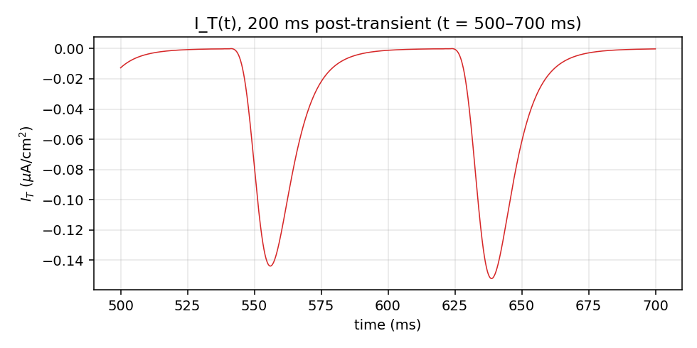
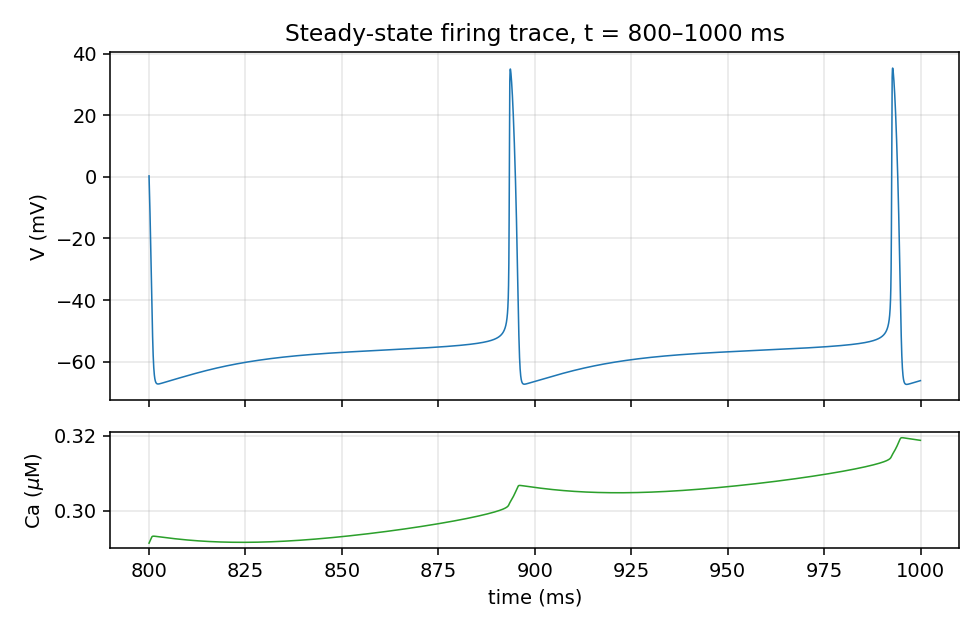
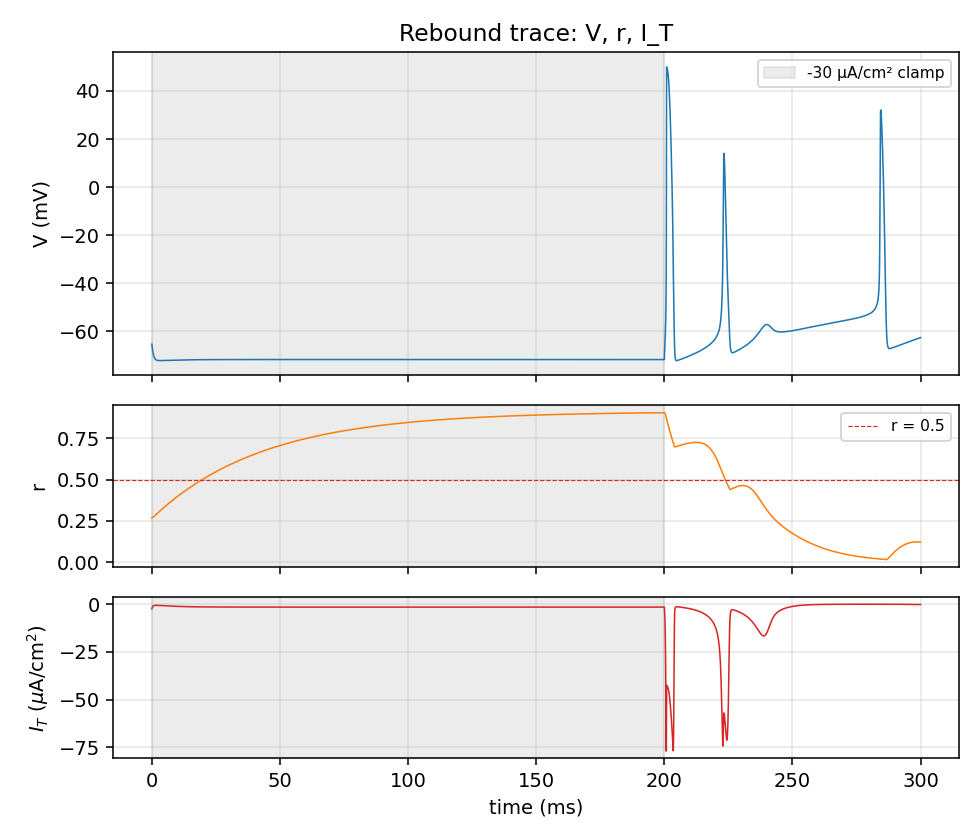

# STN linear-I_Ca diagnostics

Comprehensive biophysical check of the `bgnet/neurons/stn.py` module under the linear `I_Ca = g_Ca * sinf(V) * (V - E_Ca)` form. All single-cell, no synapses, dt = 0.025 ms.

## Summary read

Brief mechanism check:

- Resting Ca: **0.309 µM** (within RT range).
- Sub-threshold I_Ca: **-8.93 µA/cm²** (this is the candidate pacemaker if large; chronic if always negative).
- r oscillates over **[0.002, 0.136]** (RT expects ~0.05-0.5).
- I_T over the firing cycle: **mean -0.034 µA/cm²** (transient).
- Rebound: r reaches 0.91 during clamp, I_T peaks at -76.97 µA/cm² post-release, 3 rebound spikes.

Read this document end-to-end before deciding on commit.

**Question:** is the 10 Hz spontaneous firing biophysically clean, or does the linear form produce 10 Hz via a non-canonical mechanism?

## Spontaneous trace at I_drive = 0

1500 ms simulation, drop first 500 ms transient, analyse 40000 samples spanning t ∈ [500, 1500] ms. Spikes in window: **10**, firing rate **10.00 Hz**.

## 1. Resting Ca

- Mean Ca over post-transient window: **0.3088 µM**
- SD: 0.0363, range [0.2332, 0.3619]
- RT 2002 baseline Ca is typically ~0.05–0.2 µM. Observed value is within that range.

## 2. Resting I_AHP

- Mean I_AHP over post-transient window: **4.2538 µA/cm²**
- SD: 2.1302, range [1.8940, 24.3802]
- Sub-threshold (V < -40 mV) mean: 3.9584 µA/cm²

## 3. Resting I_Ca (sub-threshold)

- Sub-threshold (V < -40 mV) frac of window: 0.974
- Sub-threshold I_Ca mean: **-8.9250 µA/cm²**
- Sub-threshold I_Ca SD: 3.6761
- Supra-threshold (V > -20 mV) I_Ca mean: -61.78 µA/cm²
- Sub-threshold sinf(V) mean: 0.0908 (linear form: this is the Ca activation factor directly).

## 4. r (T-current de-inactivation) dynamics

| Variable | mean | sd | min | max |
|---|---:|---:|---:|---:|
| r | 0.0432 | 0.0410 | 0.0021 | 0.1358 |

RT expectation: r oscillates ~0.05–0.5 in a tonic firer.

## 5. binf(r) dynamics

| Variable | mean | sd | min | max |
|---|---:|---:|---:|---:|
| binf(r) | 0.0306 | 0.0371 | 0.0008 | 0.1364 |

RT expectation: small at rest, briefly large during/after spikes.

## 6. I_T contribution

- Mean I_T over post-transient window: **-0.0342 µA/cm²**
- SD: 0.0566, range [-0.2368, -0.0000]
- Time-resolved trace: 

## 7. Inter-channel current balance (sub-threshold point)

At t = 700.00 ms (i.e. 200 ms post-transient), V = -53.86 mV, Ca = 0.2705 µM, r = 0.0058.

| Current | µA/cm² | Direction |
|---|---:|---|
| I_L | +13.809 | hyperpolarizing |
| I_Na | -5.257 | depolarizing |
| I_K | +0.149 | hyperpolarizing |
| I_AHP | +4.167 | hyperpolarizing |
| I_Ca | -13.082 | depolarizing |
| I_T | -0.000 | depolarizing |
| **Sum** | -0.214 | net |

(Convention: I = g·(V - E), so negative I is depolarizing in `dV/dt = -I_ion/C_m`.)

## 8. Phase-plane: V(t) and Ca(t), 200 ms steady-state

- Spike times in window: ['893.4', '992.5']
- ISIs (ms): ['99.12']
- Ca trough/peak in window: [0.2913, 0.3195] µM (rising during spikes, decaying between is the expected pattern; flag if monotonic drift).

## 9. Rebound mechanism

- r max during -30 µA/cm² clamp: **0.906** (OK (>0.5))
- I_T most-depolarizing value in 50 ms post-release: **-76.97 µA/cm²** (transient peak)
- Spikes in 100 ms post-release: **3**

## 10. Drive-dependent f-I family

| I_drive (µA/cm²) | sigma=0 rate (Hz) | sigma=1.5 mean (Hz) | sigma=1.5 sd (Hz) |
|---:|---:|---:|---:|
| -5 | 3.00 | 4.20 | 0.40 |
| 0 | 10.00 | 11.40 | 0.49 |
| 5 | 21.00 | 21.80 | 0.40 |
| 10 | 31.00 | 31.20 | 0.40 |
| 15 | 40.00 | 39.80 | 0.40 |
| 20 | 47.00 | 47.40 | 0.49 |
| 25 | 55.00 | 54.80 | 0.40 |
| 30 | 62.00 | 62.80 | 0.40 |
