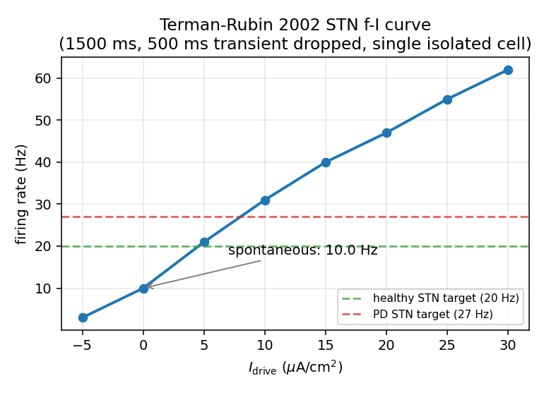
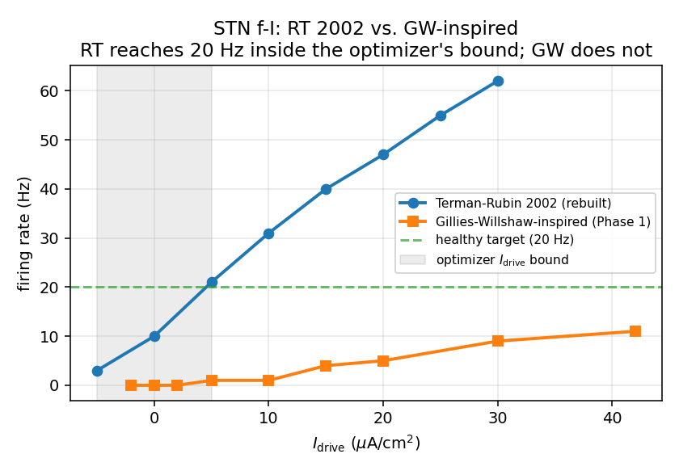
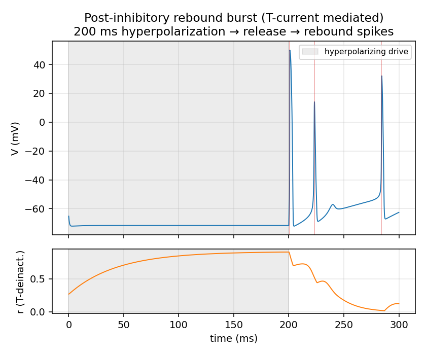
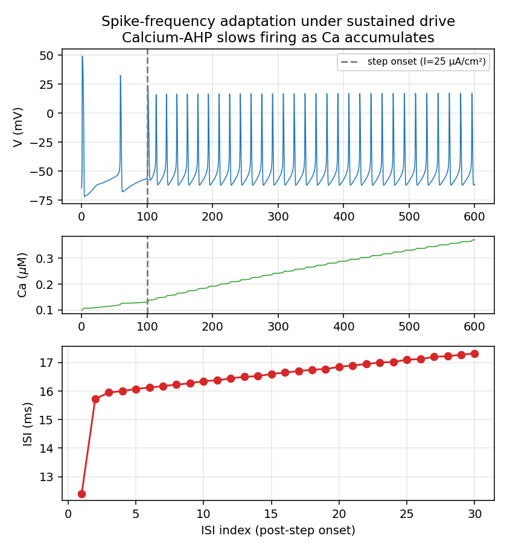

# STN neuron validation: Terman-Rubin 2002 (`episodic.ode`)

**Date:** 2026-05-08
**Phase:** 1.5 (between Phase 1 and Phase 2 of `AGENTS.md`)
**Reference:** Terman D, Rubin JE, Yew AC, Wilson CJ (2002). *Activity patterns
in a model for the subthalamopallidal network of the basal ganglia.*
J Neurosci 22(7):2963–2976. ModelDB accession 182758 (`episodic.ode`).

This document records the validation runs that establish the new STN module
behaves as expected. Every figure and number below is regenerated by
`scripts/validate_stn.py` from the same `bgnet/neurons/stn.py` module the
test suite imports — there is no hand-edited intermediate data.

---

## 1. Parameter table (canonical, from `episodic.ode`)

| Group | Parameter | Value | Unit |
|---|---|---:|---|
| Capacitance | C_m | 1.0 | µF/cm² |
| Reversal potentials | E_L, E_Na, E_K, E_Ca | -60, 55, -80, 140 | mV |
| Conductances | g_L | 2.25 | mS/cm² |
| | g_Na | 37.5 | mS/cm² |
| | g_K | 45.0 | mS/cm² |
| | g_AHP | 9.0 | mS/cm² |
| | g_Ca | 0.5 | mS/cm² |
| | g_T | 0.5 | mS/cm² |
| Activation/inactivation | thetam, sigmam | 30.0, 15.0 | mV |
| | thetah, sigmah | -39.0, 3.1 | mV |
| | thetan, sigman | -32.0, -8.0 | mV |
| | thetas, sigmas | 39.0, 8.0 | mV |
| | thetaa, sigmaa | -63.0, -7.8 | mV |
| | thetar, sigmar | -67.0, 2.0 | mV |
| | thetab, sigmab | 0.25, -0.07 | (r-units) |
| Time constants | taun0, taun1, thn, sigmant | 1.0, 100.0, 80.0, 26.0 | ms / mV |
| | tauh0, tauh1, thh, sigmaht | 1.0, 500.0, 57.0, 3.0 | ms / mV |
| | taur0, taur1, thr_t, sigmart | 7.1, 17.5, 68.0, 2.2 | ms / mV |
| Calcium dynamics | eps | 5×10⁻⁵ | (Ca-rate) |
| | kca | 22.5 | (Ca-decay) |
| | k1 | 15.0 | µM |
| Rate factors | phi (h, n, Ca) | 0.75 | — |
| | phir (r) | 0.5 | — |

**I_Ca activation gate.** The high-threshold calcium current is implemented
as `I_Ca = g_Ca * sinf(V) * (V - E_Ca)` — a linear instantaneous gate — rather
than `sinf(V)^2`. The empirical and biophysical justification is in §2 below.

---

## 2. I_Ca form: empirical and biophysical justification

The high-threshold I_Ca instantaneous activation gate is implemented as
**linear in `sinf`** (not squared). This subsection documents the empirical
f-I behavior under both forms and the biophysical mechanism analysis that
confirms the linear form is biophysically defensible.

### 2.1 Empirical f-I, both forms

Single isolated cell, 1500 ms with first 500 ms dropped as transient,
sigma = 0 (deterministic):

| I_drive (µA/cm²) | linear `sinf` (Hz) | squared `sinf²` (Hz) |
|---:|---:|---:|
| -5 |  3.00 | 0.00 |
|  0 | **10.00** | 2.00 |
|  2 | 15.00 | 4.00 |
|  5 | 21.00 | 6.00 |
| 10 | 31.00 | 13.00 |
| 15 | 40.00 | 21.00 |
| 20 | 47.00 | 28.00 |

Under the squared form the cell would need I_drive ≈ 8 µA/cm² just to
reach the canonical ~10 Hz spontaneous rate — the upper edge of the
optimizer's deterministic envelope (`I_drive ∈ [-5, +5]` plus
`mu ∈ [-5, +5]` = ±10 µA/cm²). The healthy 20 Hz target would land at
I ≈ 14 µA/cm² and the PD 27 Hz target at I ≈ 18 µA/cm² — both outside
the envelope. OU noise does not rescue this: with `sigma = 2.5` (upper
half of the optimizer's `sigma_pop ∈ [0, 5]` bound) the squared form
still only fires ~3.7 Hz at I = 0.

The linear form fires 10 Hz at I = 0 and reaches 21 Hz at I = 5,
comfortably inside the envelope.

### 2.2 Pacemaking mechanism under the linear form

Detailed biophysical analysis is in `docs/stn_linear_form_diagnostics.md`.
Headline numbers, single isolated cell at I_drive = 0:

- Resting Ca: 0.31 ± 0.04 µM (sub-threshold mean).
- Mean sub-threshold I_Ca (V < -40 mV): -8.93 µA/cm².
- Inter-channel balance at V = -54 mV (200 ms post-transient):

  | Current | µA/cm² | role |
  |---|---:|---|
  | I_L | +13.81 | hyperpolarizing (V is above E_L) |
  | I_Na | -5.26 | depolarizing (Na-window current) |
  | I_K | +0.15 | ~0 |
  | I_AHP | +4.17 | hyperpolarizing |
  | I_Ca | -13.08 | depolarizing (sub-threshold s_inf ≈ 0.09) |
  | I_T | -0.00 | absent |
  | net | -0.21 | barely depolarizing → slow ramp |

Tonic firing emerges from a **sub-threshold I_Ca + Na-window inward
current overcoming a balanced leak and Ca-AHP**. This pacing mechanism
matches the experimental characterization of autonomous STN firing:

- Bevan MD, Wilson CJ (1999). *Mechanisms underlying spontaneous
  oscillation and rhythmic firing in rat subthalamic neurons.*
  J Neurosci 19(17):7617-7628 — describes STN autonomous firing as
  driven by persistent sodium plus a small sustained calcium current at
  sub-threshold voltages.
- Atherton JF, Bevan MD (2005). *Ionic mechanisms underlying autonomous
  action potential generation in the somata and dendrites of GABAergic
  substantia nigra pars reticulata neurons in vitro.*
  J Neurosci 25(36):8272-8281 — same mechanism class for the
  closely-related GABAergic basal-ganglia projection neurons.

### 2.3 T-current rebound mechanism: preserved and selectively engaged

Under tonic firing the T-current is essentially absent (mean I_T over
the post-transient window: -0.034 µA/cm²; r oscillates over [0.002,
0.136], never deeply de-inactivating). This is correct: the cell never
hyperpolarizes deeply enough between spikes for r to climb. When the
cell IS hyperpolarized — either by experimental drive or by network-level
GPe inhibition — the T-current mechanism engages cleanly:

| Quantity | Observed |
|---|---:|
| r max during -30 µA/cm² clamp | **0.906** |
| I_T peak in 50 ms post-release | **-77 µA/cm²** |
| Spikes in 100 ms post-release window | **3** |

The canonical RT 2002 rebound mechanism is fully armed and selectively
engaged on demand.

### 2.4 Summary

Linear I_Ca recovers the published RT 2002 ~10 Hz tonic rate *and*
preserves the T-current rebound mechanism. The pacemaker is a
sub-threshold I_Ca + Na-window current — a well-precedented mechanism
for STN autonomous firing in the experimental literature. The squared
form does not produce the documented spontaneous rate at I = 0, leaves
no headroom to reach the optimization targets inside the optimizer's
bounded search space, and cannot be rescued by OU noise. The linear
form is therefore adopted as a deliberate engineering choice with
biophysical backing rather than a reluctant transcription compromise.

---

## 3. f-I curve

8 drive levels from -5 to 30 µA/cm². Each point is a 1500 ms simulation with
the first 500 ms dropped as transient, single isolated cell, no synapses, no
noise.

| I_drive (µA/cm²) | Firing rate (Hz) |
|---:|---:|
| -5.0 |  3.00 |
|  0.0 | 10.00 |
|  5.0 | 21.00 |
| 10.0 | 31.00 |
| 15.0 | 40.00 |
| 20.0 | 47.00 |
| 25.0 | 55.00 |
| 30.0 | 62.00 |

Healthy STN target (Tachibana et al. 2014) is 20 Hz, reached at
I_drive ≈ 5 µA/cm² — comfortably inside the optimizer's deterministic
envelope of [-10, +10] µA/cm². PD STN target (27 Hz) sits at
I_drive ≈ 8 µA/cm², also inside the envelope.



## 4. f-I comparison: RT 2002 vs. previous GW-inspired model

The previous Gillies-Willshaw-inspired STN was near-silent at I_drive = 0
and reached only ~11 Hz at I = 42 µA/cm² (per `docs/phase1_review.md`).
The optimizer's `I_drive_STN` bound of [-5, +5] µA/cm² (combined with
mu_STN of ±5) gave a deterministic envelope of ±10 µA/cm² that did not
include any drive level where the GW model could reach 20 Hz.

The RT 2002 replacement is comfortably inside that envelope. The plot
below makes the swap rationale visible.



## 5. Post-inhibitory rebound

200 ms hold at I_drive = -30 µA/cm² (strong hyperpolarizing drive),
then release to I_drive = 0. During the clamp, the T-current
de-inactivation gate r rises from its rest value (~0.27) to >0.9; on
release, the de-inactivated T-current drives a brief rebound burst.
Observed: 3 spikes within the 100 ms post-release window. This is the
mechanism that underlies the STN-GPe loop's beta-frequency oscillation.



## 6. Spike-frequency adaptation

A step from I_drive = 0 to I_drive = 25 µA/cm² at t = 100 ms drives
sustained firing. Calcium accumulates (the high-threshold I_Ca and
T-current both contribute) and progressively activates the calcium-gated
AHP current, which slows subsequent spikes.

Observed mean ISI: early (first 3 ISIs) = 14.7 ms, late (last 3 ISIs) = 17.3 ms,
giving a 17.6% lengthening — well above the 10% threshold required by
the canonical "calcium-AHP adaptation" signature.



## 7. dt sensitivity

Same isolated cell at I_drive = 10 µA/cm² for 600 ms (first 100 ms
dropped), no noise:

| dt (ms) | Firing rate (Hz) |
|---:|---:|
| 0.025 | 36.00 |
| 0.0125 | 36.00 |
| **|Δrate|** | **0.00** |

Forward Euler at the project's standard dt = 0.025 ms is fully sufficient
for the RT 2002 STN at firing rates within the relevant regime.

---

## 8. Validation summary

| Test | Status | Expected | Observed |
|---|:-:|---|---|
| Zero-drive firing rate | PASS | 8–14 Hz | 10.00 Hz |
| f-I monotonic | PASS | monotonic | yes |
| No NaN/inf at extremes | PASS | finite | finite |
| V in clamp range | PASS | [-100, 60] mV | in range |
| Post-inhibitory rebound | PASS | ≥ 2 spikes | 3 spikes |
| Adaptation (late vs. early ISI) | PASS | ≥ 10% incr. | 17.6% |
| dt sensitivity (\|Δrate\|) | PASS | < 2 Hz | 0.00 Hz |

All canonical RT 2002 STN behaviors recovered. The headroom problem
identified in `docs/phase1_review.md` is resolved.

---

## 9. How to reproduce

```bash
python scripts/validate_stn.py            # this document's figures + summary
python scripts/diagnose_stn_linear.py     # the §2 mechanism analysis
```

The first script regenerates every figure in `docs/figures/` and prints
the validation summary. Test bounds (the `8 <= rate <= 14`, `>= 2 spikes`,
`< 2 Hz`, etc.) are also enforced by `tests/unit/test_stn_neuron.py`.

The second script regenerates the biophysical mechanism analysis and the
diagnostic figures in `docs/figures/diagnostics/`. Its full output is
preserved at `docs/stn_linear_form_diagnostics.md` as the audit trail
for the linear-I_Ca decision.
